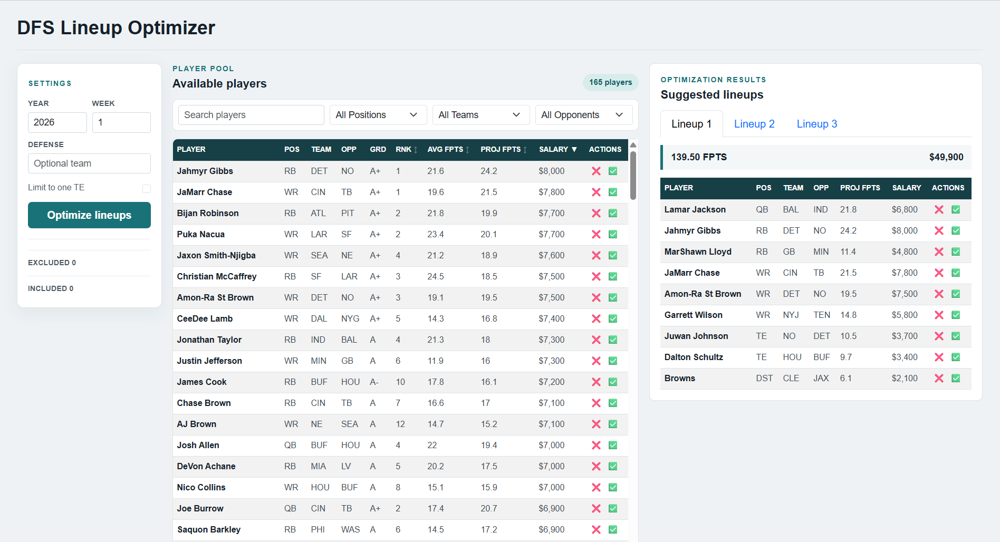

# DFS Lineup Optimizer

A full-stack application for optimizing DraftKings NFL daily fantasy sports (DFS) lineups using web scraping and mathematical optimization.

## Overview



This project combines automated data collection with lineup optimization to generate DraftKings NFL DFS lineups. It consists of Dockerized scraper services, a FastAPI backend, a React frontend, and shared CSV data mounted at `/dfs_data`.

### Key Features

- **Automated Data Collection**: Salary and projection scrapers for DraftKings and FantasyPros data
- **Lineup Optimization**: Generates multiple lineups using salary, position, projection, and player constraints
- **Web Interface**: Filterable player pool with include/exclude actions and suggested lineup results
- **Containerized**: Docker Compose build and runtime configurations for the application and data services

## Architecture

```
dfs_lineup_optimizer/
├── api/                              # FastAPI service
│   ├── main.py                       # Uvicorn entrypoint
│   ├── app/
│   │   ├── routes/                   # Projection and optimization endpoints
│   │   ├── db/                       # Projection loading and lineup optimization
│   │   ├── models/                   # Request and response models
│   │   └── configs/                  # API configuration
│   ├── Dockerfile
│   └── requirements.txt
├── frontend/                         # React web application
│   ├── src/components/               # Lineup optimizer UI
│   ├── public/
│   ├── Dockerfile
│   └── package.json
├── system/
│   ├── orchestrator/                 # Scraper scheduling service
│   ├── salary-scraper/               # DraftKings salary scraper
│   └── projection-scraper/            # Player projection scraper
├── data/                             # Stored CSV projections, salaries, and props
├── docker-compose.build.yml          # Image build definitions
├── docker-compose.run.yml            # Runtime services and ports
├── Makefile                          # Build, run, and scraper shortcuts
└── README.md
```

### Runtime Services

The runtime Compose configuration starts:

- `dfs-frontend`: React application served on port `3000`
- `dfs-api`: FastAPI application served on port `8080`
- `dfs-orchestration`: scraper scheduling service

The salary scraper also uses `selenium-web-driver` when run manually. All services share the `dfs_optimizer_network` network. The API and scraper services use `/dfs_data` as the container-mounted data directory.

## Getting Started

### Prerequisites

- **Docker** ([Install](https://docs.docker.com/get-docker/))
- **Docker Compose** (included with Docker Desktop)
- **Make** (optional, for convenient commands)
  - macOS: `xcode-select --install`
  - Ubuntu: `sudo apt-get install make`
  - Windows: `choco install make`

### Quick Start

1. Clone the repository:
```bash
git clone https://github.com/nickpasternak11/dfs_lineup_optimizer.git
cd dfs_lineup_optimizer
```

2. Build and start all services:
```bash
make build
make run
```

3. Access the application at http://localhost:3000

The frontend loads the current projection year and week from the API, displays the available player pool, and submits optimization requests to the API. The API is available at http://localhost:8080.

## Usage

### Running Scrapers

**Collect salary data and projections:**
```bash
make run-salary-scraper
make run-projection-scraper
```

Both scraper targets stop the current runtime stack before running. Run `make run` afterward to start the application stack again. The salary scraper starts Selenium automatically. The orchestrator runs as part of `make run` and manages scheduled scraper execution inside its container.

### Generate Lineups in the Web App

Use the settings panel to choose the year, week, defense, and optional one-tight-end constraint, then select **Optimize lineups**. The player pool supports:

- Search by player name
- Filtering by position, team, and opponent
- Include and exclude actions for player constraints
- Rank, grade, average FPTS, projected FPTS, and salary columns

The suggested lineups panel displays multiple optimized results with player, position, team, opponent, projected FPTS, salary, and include/exclude actions.

The API endpoints used by the frontend are:

- `GET /projections/current_year`
- `GET /projections/current_week`
- `POST /projections`
- `POST /optimize`

## Technology Stack

| Layer | Technology | Purpose |
|-------|-----------|---------|
| **Frontend** | React, JavaScript, CSS, HTML | Interactive UI for lineup management |
| **Backend** | Python, Pandas, NumPy | Data processing & optimization engine |
| **Scraping** | BeautifulSoup, Selenium, Requests | Web scraping for salary & projection data |
| **Orchestration** | Docker, Docker Compose, APScheduler | Container management & task scheduling |
| **Deployment** | Docker | Containerized microservices |

## Key Components

### Orchestrator
Runs the scraper scheduling workflow in its own container. It shares the data directory and Docker socket so scheduled scraper jobs can run alongside the application services.

### Salary Scraper
Extracts player salary data from DraftKings using Selenium and Chromium. The manual Make target starts the Selenium WebDriver container before running the scraper.

**Supports multiple contest slates:**
- Thu-Mon, Fri-Mon, Sat-Mon, Sat-Sun

### Projection Scraper
Fetches player projections and historical stats from FantasyPros and stores weekly projection CSVs.

**Data collected:**
- Weekly projections by position (QB, RB, WR, TE, DST)
- Historical performance stats
- Expert consensus grades

### API and Lineup Optimizer
The FastAPI service loads stored weekly data and exposes the projection and optimization endpoints. Its optimization engine constructs valid lineups within DraftKings constraints.

**Optimization approach:**
- Maximizes projected fantasy points
- Respects salary cap
- Enforces position limits
- Removes low-graded players

## Development

### Docker and Make Commands

```bash
# Build all images
make build

# Start the application stack
make run

# Stop services
make down

# Run the data scrapers manually
make run-salary-scraper
make run-projection-scraper
```

To run the frontend locally outside Docker:

```bash
cd frontend
npm install
npm start
```

The legacy Create React App toolchain may require `NODE_OPTIONS=--openssl-legacy-provider` with newer Node versions.

## Data Storage

- **Salary data**: `data/salaries/dk_salary_YYYY_wW.csv`
- **Projections**: `data/projections/fp_projection_YYYY_wW.csv`
- **Player props**: `data/props/player_props_*.csv`

At runtime, these files are mounted into containers through `/dfs_data:/app/data`. The API reads stored projections and salary data when handling requests; optimized lineups are returned in the API response and are not currently written to a separate lineups directory.

