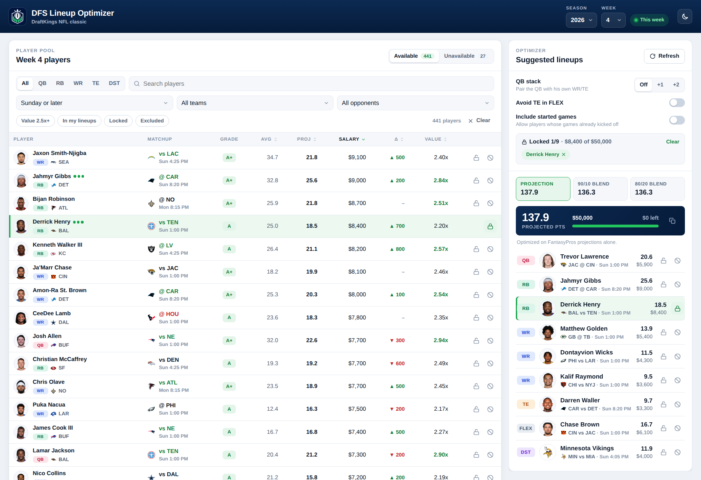

# DFS Lineup Optimizer

A full-stack application for optimizing DraftKings NFL daily fantasy sports (DFS) lineups using web scraping and mathematical optimization.

## Overview

<picture>
  <source media="(prefers-color-scheme: dark)" srcset="media/dfs_optimizer_img_dark.png">
  
</picture>

This project combines automated data collection with lineup optimization to generate DraftKings NFL DFS lineups. It consists of Dockerized scraper services, a FastAPI backend, a React frontend, and a PostgreSQL database that all services share.

### Key Features

- **Automated Data Collection**: Salary and projection scrapers for DraftKings and FantasyPros data
- **Historical Backfill**: Scrapers can collect past seasons' data for the current week
- **Lineup Optimization**: Generates multiple lineups using salary, position, projection, and player constraints
- **Web Interface**: Player pool with headshots, team logos and filters; lock/exclude actions that re-optimize instantly; three lineup strategies side by side; light and dark themes
- **Projection Accuracy**: Every past week's projections scored against actual DraftKings points and a recent-average baseline, by position, week and salary
- **Containerized**: Docker Compose build and runtime configurations for the application and data services

## Architecture

```
dfs_lineup_optimizer/
├── api/                              # FastAPI service
│   ├── main.py                       # Uvicorn entrypoint
│   ├── app/
│   │   ├── routes/                   # Projection and optimization endpoints
│   │   ├── db/                       # Player pool loading and lineup optimization
│   │   ├── models/                   # Request and response models
│   │   └── configs/                  # API configuration
│   ├── Dockerfile
│   └── requirements.txt
├── frontend/                         # React web application
│   └── src/
│       ├── api/                      # API client
│       ├── hooks/                    # App state: optimizer, player pool filters, theme
│       ├── components/               # header/, pool/, lineups/, common/ (avatars, logos, badges)
│       ├── lib/                      # Pure logic with tests: roster rules, kickoffs, teams, formatting
│       └── styles/theme.css          # Design tokens for the light and dark themes
├── system/
│   ├── orchestrator/                 # Scraper scheduling service
│   ├── salary-scraper/               # DraftKings salary scraper
│   ├── projection-scraper/           # FantasyPros projection scraper
│   ├── game-log-loader/              # nflverse games and weekly game logs
│   └── projection-model/             # Our DraftKings projections and their backtest
├── shared/                           # Python packages copied into every service image
│   ├── dfs_db/                       # DB config, sessions, ORM models, writes
│   └── dfs_common/                   # Logging, season year, FantasyPros HTTP helpers
├── db/                               # Schema migrations (Alembic)
│   └── migrations/versions/          # One file per schema change
├── migration/                        # One-time CSV → PostgreSQL data load
├── data/                             # Legacy CSV salaries and projections
├── docker-compose.build.yml          # Image build definitions
├── docker-compose.run.yml            # Runtime services, ports and volumes
├── .env.example                      # Database credentials template
├── Makefile                          # Build, run, scraper and database shortcuts
└── README.md
```

### Runtime Services

The runtime Compose configuration starts:

- `dfs-postgres`: PostgreSQL 16, data in the `dfs_postgres_data` Docker volume, port `5432` on `127.0.0.1` only
- `dfs-frontend`: React application served on port `3000`
- `dfs-api`: FastAPI application served on port `8080`
- `dfs-orchestration`: scraper scheduling service

The orchestrator image bundles both scrapers and the game log loader, and runs them on its schedule. The standalone scraper images, the schema tool (`dfs-db-migrate`) and the CSV loader (`dfs-migration`) are one-off images run by `make`. All services share the `dfs_optimizer_network` network.

## Getting Started

### Prerequisites

- **Docker** ([Install](https://docs.docker.com/get-docker/))
- **Docker Compose** (included with Docker Desktop)
- **Make** (optional, for convenient commands)
  - macOS: `xcode-select --install`
  - Ubuntu: `sudo apt-get install make`
  - Windows: `choco install make`

### Quick Start

1. Clone the repository:
```bash
git clone https://github.com/nickpasternak11/dfs_lineup_optimizer.git
cd dfs_lineup_optimizer
```

2. Create `.env` and set a real `POSTGRES_PASSWORD`. `.env` is git-ignored; never commit it.
```bash
cp .env.example .env
```

3. Build and start all services, then create the database schema:
```bash
make build
make run
make db-upgrade
```

4. Load data, either by scraping the current week or by importing the legacy CSVs (see [Migrating from CSV](#migrating-from-csv)):
```bash
make run-salary-scraper
make run-projection-scraper
```

5. Access the application at http://localhost:3000

The frontend loads the current season and week from the API, displays the available player pool, and submits optimization requests to the API. The API is available at http://localhost:8080.

## Usage

### Running Scrapers

With no arguments, each scraper collects the current week, the same as the orchestrator's schedule:

```bash
make run-salary-scraper
make run-projection-scraper
```

The stack must be running (`make run`), since the scrapers write to `dfs-postgres`.

Scheduled runs (orchestrator):
- **Salary scraper**: Tuesdays at 9:00 AM ET
- **Past-season backfill**: Tuesdays at 9:30 AM ET (see below)
- **Projection scraper**: hourly, 10:00 AM–8:00 PM ET, Tuesday through Thursday
- **Game log loader**: daily at 6:00 AM ET (see [Game Logs and Results](#game-logs-and-results))
- **Missed-run catch-up**: daily at noon ET, and whenever the orchestrator starts
- **Database backup**: daily at 3:00 AM ET

Scraper and game log jobs are skipped March through August, when FantasyPros has no current week. Backups run year-round.

### Missed Runs and Alerts

The schedule only fires at fixed times, so if the stack is down on a Tuesday, that week's jobs never run. Past seasons' salaries in particular can only be collected during their week (see below). To cover this, the orchestrator checks the database at startup and daily at noon ET. If the current week has no live salaries, no live projections, or no past-season backfill, it runs what's missing.

It doesn't check on Mondays or on Tuesdays before 10:00 AM ET. That leaves room for Tuesday's scheduled runs, and avoids the window where the week number has rolled over but the salary page hasn't, which would file last week's salaries under the new week.

To be notified when a scheduled scrape, backfill, catch-up or backup fails, set a Slack or Discord incoming-webhook URL in `.env`:

```bash
ALERT_WEBHOOK_URL=https://discord.com/api/webhooks/...
```

Each alert includes the failed job's last 15 log lines. Without the URL, failures are only logged (`docker compose -f docker-compose.run.yml logs dfs-orchestration`).

### Backfilling Past Seasons

Both scrapers can collect past seasons, with one constraint: **the salary source only serves the current NFL week**. It accepts any season, but you can only collect past seasons' salaries for the week the live season is currently in. So during week N of the live season, you backfill week N of every past season.

**This runs automatically.** Every Tuesday at 9:30 AM ET the orchestrator backfills the current week for every season from 2018 through last season, so during 2026 week 3 it collects week 3 of 2018–2025. The history fills in one week at a time over the season. Set `BACKFILL_START_YEAR` in `.env` to change the first season.

To run it by hand, e.g. if the stack was down on Tuesday, run it before the next week starts:

```bash
make backfill
```

Or with explicit options: `--start-year` alone covers through last season, and the projection scraper's `--week` defaults to the current week:

```bash
make run-salary-scraper     ARGS="--start-year 2018"
make run-projection-scraper ARGS="--start-year 2018 --end-year 2020 --week 5"
```

A projection-only backfill works for any week at any time. Salaries don't.

What backfilled weeks contain:

| Field | Past seasons |
|-------|--------------|
| Rankings, grades, projected and average FPTS | Real, week-specific |
| Injury status and type | Real, week-specific |
| Salary, opponent, home/away | Real, for the current week number only |
| Kickoff | `NULL`: the source only gives a weekday and time |

Each scraper run replaces that week's rows entirely, so re-running a week is safe and removes stale or renamed players. A week appears in the player pool only once both scrapers have written it.

Scrapers refuse to save a partial scrape. A run fails without writing anything if:
- a page errors after 3 retries,
- any position's rankings come back empty,
- the current week can't be determined, or
- the new scrape has under 80% of the rows already stored for that week.

The last check exists because a changed page layout can return plausible-looking but incomplete data. If a week legitimately shrank, override it with `--allow-shrink`, e.g. `ARGS="--year 2025 --week 3 --allow-shrink"`. In a `--start-year` backfill, a failing season is logged and skipped, and the run exits non-zero.

Other scraper options: `--year` and (projections only) `--week` scrape a single target, e.g. `ARGS="--year 2024 --week 5"`.

### Game Logs and Results

`dfs-game-log-loader` loads [nflverse](https://github.com/nflverse/nflverse-data) data: every game's kickoff, final score and closing Vegas lines, and each QB/RB/WR/TE and team defense's weekly stats scored with DraftKings rules. The orchestrator reloads the current season every morning; to load history once:

```bash
make backfill-game-logs                      # 2012 (GAME_LOG_START_YEAR) through this season, under a minute
make run-game-log-loader ARGS="--year 2024"  # one season
```

Each run replaces whole seasons, since nflverse rebuilds its files with stat corrections, and refuses to replace one with under 80% of its rows (override with `--allow-shrink`).

It also loads the NFL's weekly injury reports (`injury_reports`, from 2009): one row per listed player per week, with the final game status (Out, Doubtful, Questionable; Probable until 2015) and that week's latest practice participation. nflverse rebuilds them about twice a day in season, so the 6 AM load has each week's final statuses before the model needs them:

- **Thursday games:** final statuses come out Wednesday afternoon and are loaded Thursday morning, before the 8:30 model run and the 9:00 lineup save.
- **Sunday games:** final statuses come out Friday afternoon and are loaded Saturday morning.

The reports don't cover game-day inactives (which Questionable players sit) or players on a reserve list (injured reserve, PUP...), who aren't on the report at all. For those, it loads nflverse's weekly rosters too (`weekly_rosters`, from 2016; earlier files repeat one status all season): each QB, RB, WR and TE's roster status each week. From 2016 to 2025, 0.1% of players with a status other than active or game-day inactive played. The model projects them at 0. It doesn't use the rosters for teammates-out: counting those players as missing there didn't help the backtest (average miss 5.82 against 5.81, ranking 0.393 against 0.391). Even the old version that knew exactly who played scores no better than the reports (see [Live projections](#live-projections)).

The `player_week_results` view puts every pool player's projection next to what they actually scored, the basis for variance estimates and backtesting:

```sql
SELECT year, week, player, position, salary, proj_fpts, actual_dk_points
FROM player_week_results WHERE year = 2026 AND week = 3 ORDER BY salary DESC;
```

How pool players are linked to their game logs:
- **QB/RB/WR/TE:** the best of three links. First, a game log that week with the same name and team (`name_key`: letters only, ignoring case, punctuation and Jr./Sr./II–V). Then the row's own `fp_player_id`, through the DynastyProcess crosswalk to nflverse's ids (`nfl_players`). Last, an id borrowed from the same name's other weeks: a FantasyPros id, or a week match carried to weeks the player sat out, when that name only ever matched one player. The name, team and week match agrees with the FantasyPros id on 8,012 of 8,013 player-weeks where both exist (the one exception was a wrong id), and it links the pre-2024 weeks that have no FantasyPros ids: 97–99% of players projected for 5+ FPTS link in every season.
- The matches live in the `pool_player_links` materialized view, which the game log loader refreshes after every run (`make normalize-names` does too, since the links are keyed by name).
- **DST:** by team. Points allowed use the opponent's final score; DraftKings excludes points the defense didn't give up (a pick-six thrown by its own offense), which team-level data can't separate.
- `actual_dk_points` is `NULL` when a linked player had no stats that week (inactive, or not played yet). When `gsis_id` is also `NULL`, the player couldn't be linked.

Player scoring was checked against nflverse's own PPR totals across 2025: the two differ by exactly DraftKings' rules (yardage bonuses, −1 for interceptions and lost fumbles, offensive fumble-recovery TDs) on every player-week.

### Projection Accuracy

The **Accuracy** page (header link, or http://localhost:3000/#/accuracy) shows how the projections compared with actual DraftKings points over every past week in the database, against a simple baseline: each player's recent average (the Avg column, rebuilt for each week from the games before it, so no week sees its own result).

- **Views:**
  - **History** compares FantasyPros with the baseline over every week since 2018.
  - **Live: our model** puts our model (#44) first and compares all three, but only on games it projected before kickoff (see [Live projections](#live-projections)). Each player-week is scored on the last snapshot the model stored before that game's kickoff, so the live record has no hindsight. It's the record that decides when the model replaces FantasyPros in the optimizer.
  - **Lineups** reviews the lineups the optimizer suggested. At 9 AM ET on the day of each week's first game (usually Thursday), the three default lineups on FantasyPros' projections and the three on our model's are saved (`lineup_snapshots`), so they cover the whole Thursday-to-Monday classic slate. A classic contest locks each player at their own kickoff, so on Sunday at 11:50 AM ET, after inactives, each lineup also gets a late swap: its players whose games have started stay, every other started player is left out, and the rest is re-optimized on fresh projections within the salary left. The review shows each lineup before and after the swap, and a season row of what swapping added. Each is scored on what its players actually scored (a player who didn't play counts zero), and against the best lineup possible in hindsight: the optimizer run on actual points, over the same players whose games were still to come, with the same default settings. A season table shows every saved week; weeks still in progress are marked and left out of the averages. The review opens on the newest finished week.
- **Filters:** season, position, and which players count: all, or those any source projected for 5+ or 10+ FPTS (any source, so the filter favors none).
- **Tiles:** average miss, the share within 5 FPTS, ranking (Spearman correlation inside each position-week, the choice the optimizer makes) and bias (actual minus projected), each with the other sources beside it.
- **Average miss by week**, with a crosshair (arrow keys work too), and **calibration**: what players scored on average for each range of projection, against the line where they'd score exactly as projected. Each chart has a table view.
- **By position** and **by salary** tables; the better value of each pair is bold.

As of 2026 week 4 (7,983 player-weeks since 2018), the projection misses by 5.8 FPTS on average against the baseline's 6.6, ranks players better at every position (0.41 against 0.26), and runs 0.4 FPTS low, 1.3 for QBs: DraftKings' yardage bonuses and lighter turnover penalty, which a full-PPR projection leaves out (#42). Rows whose game isn't final are left out; inactive players, unmatched players and players with no recent games are counted beneath the tiles but not compared.

The metrics live in `dfs_common.accuracy` so model work can score new sources the same way: a new source is a column in `dfs_db.accuracy_rows`' query plus an entry in `VIEWS` (`api/app/helpers/accuracy.py`), and the page picks it up. Each source keeps its chart color in every view: FantasyPros blue, the recent average orange, our model aqua.

### Projection Model

`dfs-projection-model` is our own DraftKings projection (#44), built only from data we can use commercially: nflverse game logs, snap counts, schedules and betting lines. It never uses FantasyPros' numbers, which serve only as the benchmark to beat. It doesn't feed the optimizer yet; for now it runs as a backtest:

```bash
make backtest-model    # reads the database (and nflverse), writes nothing; a couple of minutes
```

- **Training data:** every QB/RB/WR/TE and team defense regular-season game since 2012 (`make backfill-game-logs`), about 81,500 player-weeks.
- **Features,** all known before kickoff:
  - recent and longer-run usage and production (targets, carries, pass attempts, yards, TDs, DraftKings points, shares of the team's targets, carries, attempts and snaps), shifted so a game never sees its own result
  - the team's recent offense
  - what the opponent allowed to the position over its last six games
  - the game's betting lines: implied totals, spread, over/under and home/away
  - **teammates out:** the target, carry and pass-attempt share of the team's regulars who won't play, by team and by position. A regular is missing when the injury report lists them Out or Doubtful, or when they're on another team that week (a trade, a move since last season). That's what's known before kickoff, the same in training and live.
  - **the player's own injury report:** whether they're listed, Questionable (or Probable before 2016), and how much they practiced. Questionable players who play score less (8.8 FPTS against 10.5 for unlisted players, 2016–2025).
  - for defenses, days of rest and whether the game is in a fixed dome. Weather isn't used: nflverse's schedule only records it after the game.
- **Model:** one gradient-boosted model per position, predicting DraftKings points.
- **Walk-forward backtest:** each season is predicted by models trained only on the seasons before it, then scored on the accuracy page's rows against FantasyPros and the recent-average baseline.

On 8,269 player-weeks from 2018 to 2026 week 4:

| | FantasyPros | Recent avg | Model | Model + FantasyPros |
|---|---|---|---|---|
| Average miss (FPTS) | 5.76 | 6.53 | 5.82 | 5.72 |
| Ranking within position-week | 0.430 | 0.290 | 0.389 | 0.420 |

- **By position:** the model ties FantasyPros at RB (6.13), beats it at TE (5.07 against 5.13), and trails slightly at DST (4.30 against 4.27), QB and WR.
- **The blend:** the 50/50 blend beating FantasyPros shows the model knows something FantasyPros doesn't. It's a diagnostic, not a product, because the product model can't take FantasyPros as an input.

**Tried and dropped**, each backtested against the model without it:
- weighting recent seasons more
- larger or more trees (worse: overfitting)
- nflverse's air yards, air-yards share, WOPR, EPA and first downs
- rest days and domes for players (they help only defenses)

History looks close to tapped out. The remaining gap, mostly ranking, is pre-game news (injuries, depth charts, role changes), which is what player props (#50) and injury data (#46) carry.

#### Live projections

Every morning in season at 8:30 AM ET, the orchestrator runs the model's `predict` step:

- **Training:** on every game played so far.
- **Projections:** each pool player whose game hasn't kicked off is projected, through placeholder rows for the upcoming games. The same feature code builds their history from earlier games and their betting lines from the schedule.
- **Storage:** the run is stored in `model_projections` as a snapshot. Rows are never updated, so each player-week can be scored on the last projection made before its kickoff: a live record with no hindsight.
- **Optimizer:** unaffected. It still uses FantasyPros.

```bash
make predict-model                   # store a snapshot now
make predict-model ARGS="--dry-run"  # print instead
```

At 9 AM ET on the day of the week's first game, after that morning's projections, the orchestrator also saves the week's suggested lineups for the review. You can save again any time before the first kickoff, for example after fresh projections (`make predict-model`, then `make save-lineups`, with the API running): each save is a new snapshot, and the newest one is what the review and the late swap use. Once the first game kicks off, saves are refused, since the whole slate is locked by then. Sunday brings the late swap:

- **11:35 AM ET:** a FantasyPros scrape, for Sunday's news and inactives
- **11:40 AM ET:** a model run
- **11:50 AM ET:** the swap (`make save-lineups ARGS=--late-swap`)

The swap is only as good as Sunday's information. The FantasyPros scrape has the inactives, but the model only knows who Friday's injury report ruled out, not which Questionable players sit.

Snapshots carry `model_version`:

- **Version 1** had no injury data, so live it couldn't see who was out.
- **Version 2** (#46) uses the injury reports. Players listed Out or Doubtful are projected at 0: of skill-position regulars listed 2016–2025, none listed Out played and 0.9% of Doubtful did.
- **Version 3** adds the weekly rosters: players off the active roster are projected at 0, for example Tank Dell in 2026 week 5, practicing on his way back from reserve but not yet activated. Practice-squad players count as off until the roster shows them elevated, usually on Saturday.
- **Questionable players** are projected as if they play, because 63% did (76% after a full practice, 42% after none). Swap them on Sunday if they're ruled inactive.

In the backtest, teammates-out from the injury reports scores the same as the old version that knew who actually played: average miss 5.80 and ranking 0.394 against 5.80 and 0.394. So the backtest holds, and live predictions now get the same information.

#### Player props

`make backtest-props` turns sportsbook player props into DraftKings projections and scores them on the season an Odds API export covers (`/dfs_data/props/`, 2024 weeks 1–15):

- **Over/under markets** (passing, rushing and receiving yards, receptions, passing TDs, interceptions) have the bookmaker's margin removed book by book. The line and the fair chance of the over then give the stat's mean. Counts use a Poisson distribution; yards use a gamma, whose spread comes from earlier seasons and which also gives the chance of the 100- and 300-yard bonuses.
- **Anytime-TD prices** are one-sided, so their margin is fitted.
- **Missing markets** fall back to the player's recent averages. A projection needs the position's main market: passing yards for QBs, rushing yards for RBs, receiving yards for WRs and TEs.
- **Fitting:** the TD margin and the model + props blend weight are fitted on the first half of the weeks and scored on the second.

On 2024 weeks 9–15 (807 player-weeks with all four):

| | FantasyPros | Model | Props | Model + props (45/55) |
|---|---|---|---|---|
| Average miss (FPTS) | 6.27 | 6.33 | 6.34 | 6.28 |
| Ranking within position-week | 0.397 | 0.368 | 0.404 | 0.410 |
| Bias | +0.60 | +0.69 | −0.55 | +0.01 |

- **Props rank players better than FantasyPros** (WRs 0.381 against 0.350, RBs 0.593 against 0.574), which is the model's weak spot.
- **Model + props** ties FantasyPros on average miss and beats it on ranking, without any FantasyPros data.

It's one season and half of it held out, so differences of a few hundredths are within noise. The export also doesn't say when the lines were taken: closing lines are sharper than early-week ones.


### Generate Lineups in the Web App

Open http://localhost:3000. The app loads the current week and optimizes right away; pick another **Season** and **Week** in the header to load an older slate (**Back to this week** returns). Any change re-runs the optimizer immediately, so there is no Optimize button. On a past week every game has kicked off, so all players count: started games are included and the games filter starts on all games.

**Suggested lineups** (right; on top on phones):

- Settings: QB stack (off, +1 or +2 pass catchers from the QB's team), avoid a TE in FLEX, and include players whose games have started.
- Three lineups, one per strategy: **Projection** (FantasyPros projections), **90/10 blend** and **80/20 blend** (projection blended with the recent average). Each tab and card headlines the plain projected total so the three compare directly; blended lineups also show the score they were optimized on.
- Each card shows salary used against the $50,000 cap, the roster in slot order with headshots and matchups, and a copy button that puts the lineup on the clipboard as text.
- The lock button forces a player into every lineup; the exclude button removes them. Locks reset when the slate changes; exclusions are remembered per week in the browser.

**Player pool** (left):

- Position tabs, name search, a games filter (all, Friday or later, Sunday or later, Sunday 1 PM ET+; it defaults by day of the week), and team and opponent filters.
- Quick filters: value plays (2.5x+), players in your lineups, locked, excluded.
- Available and Unavailable tabs; Unavailable holds players whose games started and players you excluded, with a restore button for the latter.
- Columns: matchup, grade, recent average, projection, salary, salary change and value. The dots after a name show which lineups the player is in.
- **Matchup** ranks the opponent against the player's position: all 32 teams by the FPTS they allowed to that position per game over the last four weeks (all of last season in week 1). 1st allowed the fewest, so a team can be a tough matchup for RBs (Arizona, 4th) and a soft one for QBs (27th) in the same week. The rank shows beside the opponent, red for 1st–10th and green for 23rd–32nd; hover for the points allowed. For a DST it's the offense it faces, ranked by what that offense gave up to defenses. The column sorts softest first, and the player card shows it as a tile.
- **Total** is the team's implied points from the betting lines: its share of the game's over/under by the spread, (total − spread) / 2. The over/under shows beneath it, and the spread and both teams' implied totals on hover. Lines come from the nflverse schedule, refreshed with the game logs each morning; past weeks show closing lines. Sortable, and on the player card.
- **Avg** is DraftKings points per game over the four weeks before the slate (all of last regular season in week 1), scored from the nflverse game logs so it matches the Actual column and the player card. FantasyPros' own average is full PPR: no 3-point bonuses at 300 passing, 100 rushing or 100 receiving yards, and −2 rather than −1 for an interception or lost fumble, which put it about 0.4 points a game below DraftKings (1.2 for QBs). The few players we can't link to nflverse keep FantasyPros' number. The projection is still FantasyPros' full-PPR projection.
- **Actual** appears once any game that week is final: the DraftKings points each player scored, marked ▲ if they beat their projection and ▼ if not. Sortable, like the projection.
- Click a player (or their name, from the keyboard) for their card: headshot, team and matchup, bio (age, height, weight, college, draft), this week's salary, projection, actual, value and grade, and their game log by season. The chart shows FPTS per game (DraftKings scoring, as everywhere in the app), with our projection as a dot for the weeks we had one, and the table below it lists each game's result and stats. Lock and exclude work from the card too. Esc or a click outside closes it.

Headshots come from FantasyPros' image CDN by `fp_player_id`, and team logos from ESPN's; both are loaded by the viewer's browser. Weeks scraped before `fp_player_id` was collected show initials until they are scraped again.

The API endpoints used by the frontend are:

- `GET /projections/current_year`
- `GET /projections/current_week`
- `POST /projections`
- `POST /optimize`
- `GET /game-logs/players/{gsis_id}`: a player's bio and every game since 2018
- `GET /game-logs/dst/{team}`: a defense's every game since 2018 (either `LAR` or `LA` works)
- `GET /accuracy?view=history|live&year=&position=&min_proj=5`: the accuracy page's report, every source's metrics overall, by position, week and salary, plus calibration
- `GET /lineups/review?year=&week=`: a week's saved lineups with their actual points, the best lineup in hindsight, and the season's weekly totals (the newest finished week by default)

`POST /projections` returns a list of `ProjectionRecord`s, one per player in the week's pool; `POST /optimize` returns three lineups, each a list of nine `LineupPlayer`s with the same fields. Both models live in `api/app/models/responses/` and are published in the OpenAPI schema at http://localhost:8080/openapi.json. Each record also carries `gsis_id` (for the game log endpoint), `actual_dk_points` (`null` until the game is final), the matchup (`opp_fpts_allowed`, `opp_fpts_allowed_rank` with 1 = fewest allowed, and `opp_games`), the betting lines (`game_total`, `team_spread` with favorites negative, and `implied_total`, `null` until the game has lines), and `model_fpts`, our model's latest projection before the player's kickoff. `POST /optimize` takes `projection_source`: `fantasypros` (the default) or `model`, which optimizes on `model_fpts` and reports it as `proj_fpts`. Fields the older weeks lack (`kickoff`, `home`, `salary_change`, injuries, `fp_player_id`) are `null` there, and `avg_fpts` is `null` for a player with no games in its window (a rookie in week 1); `kickoff` is a string like `2026-10-04T20:05:00+0000`.

## Technology Stack

| Layer | Technology | Purpose |
|-------|-----------|---------|
| **Frontend** | React 18, Vite, Vitest, CSS | Interactive UI for lineup management |
| **Backend** | Python, FastAPI, Pandas, PuLP | API and optimization engine |
| **Database** | PostgreSQL, SQLAlchemy, Alembic | Storage, data access and schema migrations |
| **Scraping** | Requests, BeautifulSoup, Pandas | Salary and projection collection |
| **Orchestration** | Docker, Docker Compose, schedule | Container management and task scheduling |

## Key Components

### Orchestrator
Runs the scraper and backup schedule in its own container. Both scrapers' code is copied into its image, and each scheduled scrape runs the scraper's `main.py` as a child process with the orchestrator's database credentials. It has no access to Docker, so a compromised dependency in it can't reach the host. Backups use a PostgreSQL 16 `pg_dump`, matching the server, installed in the same image.

### Salary Scraper
Collects DraftKings salaries, opponents, home/away and kickoff times from the FantasyPros DraftKings salary-changes page, and writes them to `player_salaries`.

### Projection Scraper
Collects FantasyPros weekly rankings, expert grades, projected points, trailing four-week average points and injury reports for QB, RB, WR, TE and DST, and writes them to `player_projections`.

### Projection Model
Builds point-in-time features from the game-log tables and trains one model per position on earlier seasons; `make backtest-model` scores it against FantasyPros season by season. See [Projection Model](#projection-model).

### Game Log Loader
Downloads nflverse's season files (schedules, weekly player and team stats) and the DynastyProcess player id crosswalk, scores each week with DraftKings rules, and writes `nfl_games`, `player_game_logs`, `dst_game_logs` and `nfl_players`, then refreshes `pool_player_links`.

### API and Lineup Optimizer
The FastAPI service reads each week's player pool from PostgreSQL and exposes the projection and optimization endpoints. Its optimization engine constructs valid lineups within DraftKings constraints.

**Optimization approach:**
- Maximizes projected fantasy points
- Respects salary cap
- Enforces position limits
- Excludes players whose games have already kicked off (unless requested)

**Scaling:** the API runs `API_WORKERS` uvicorn processes (default `auto`: one per core, up to 4), since building the optimization model is CPU-bound and one process uses about one core. Each worker caches a week's player pool and the latest week for `API_CACHE_TTL_SECONDS` (default 300; `0` disables). Each worker also holds up to `DB_POOL_SIZE + DB_MAX_OVERFLOW` (default 10) database connections, so keep `API_WORKERS` × that well under Postgres' 100. Set `API_WORKERS` and `API_CACHE_TTL_SECONDS` in `.env`. `make load-test` measures throughput and latency; see [api/loadtest/README.md](api/loadtest/README.md) for the method and before/after results.

## Data Storage

All data lives in PostgreSQL (database `dfs`), in the `dfs_postgres_data` Docker volume.

| Object | Written by | Contents |
|--------|-----------|----------|
| `player_salaries` | Salary scraper | Salary, salary change, team, opponent, home/away, kickoff |
| `player_projections` | Projection scraper | Rank, grade, projected and average FPTS, injury status, FantasyPros player id |
| `weekly_player_pool` (view) | — | Joins the two per `(year, week, player)` and derives `value`; this is what the API reads |
| `nfl_games` | Game log loader | Every game's kickoff, final score, spread, total and moneylines |
| `player_game_logs` | Game log loader | Weekly QB/RB/WR/TE stats and DraftKings points, keyed on nflverse's `gsis_id` |
| `dst_game_logs` | Game log loader | Weekly team defense stats, points allowed and DraftKings points |
| `nfl_players` | Game log loader | nflverse `gsis_id` to FantasyPros `fp_player_id`, plus birth date, height, weight, college and draft |
| `injury_reports` | Game log loader | The NFL's weekly injury reports: final game status and practice participation, from 2009 |
| `weekly_rosters` | Game log loader | Each week's roster status for QBs, RBs, WRs and TEs (active, reserve, practice squad...), from 2016 |
| `pool_player_links` (materialized view) | Game log loader (refresh) | Pool players matched to nflverse ids by name, team and week |
| `model_projections` | Projection model | Our model's projections, one snapshot per daily run, never updated |
| `lineup_snapshots` | Projection model | The optimizer's suggested lineups on each projection source, saved the morning of each week's first game, never updated |
| `player_week_results` (view) | — | Each pool player's projection beside their actual DraftKings points |

The two scraped tables are keyed on `(year, week, player)`. Columns that older data predates (`home`, `kickoff`, `salary_change`, `injury_status`, `injury_type`, `fp_player_id`) are nullable.

To inspect the data:
```bash
make psql
```

The volume survives `make down` and restarts. **`docker compose -f docker-compose.run.yml down -v` or `docker volume rm dfs_postgres_data` deletes all data**, and anything scraped since the CSV migration exists nowhere else. Keep backups (below).

### Player Names

Players are stored under FantasyPros' rankings spelling ("A.J. Brown", "Ja'Marr Chase", "Patrick Mahomes II"), which `weekly_player_pool` joins salaries to projections on. Other sources drop characters: the legacy CSVs strip punctuation and suffixes, and the salary page sometimes drops a suffix ("KC Concepcion" for "KC Concepcion Jr.").

- **Each week:** after writing, both scrapers rename that week's salary rows to the projections' spelling of the same player, so a mismatch can't drop him from the pool.
- **History:** `make normalize-names` renames every older spelling to FantasyPros', once (`ARGS=--dry-run` to preview). It is safe to re-run.

Two spellings count as the same player when they share a position and the same letters, ignoring case, punctuation and a trailing Jr./Sr./II–V. A spelling scraped with a FantasyPros id is canonical; otherwise the longest wins, since other sources only ever remove characters. A rename never applies to seasons before the canonical spelling first appears, so a father's seasons keep his name (Frank Gore's 2018–20 rows stay; Frank Gore Jr.'s are renamed), and never to a week that already has the canonical spelling.

### Backups

The orchestrator runs `pg_dump` every night at 3:00 AM ET and writes the result to `/dfs_backups` on the host. That directory is outside the Docker volume, so `down -v` doesn't touch it. It keeps the newest 14 dumps. A failed dump never deletes older ones.

```bash
make backup                                    # take a backup now
make list-backups                              # newest first
make restore FILE=dfs_20260926T070000Z.dump    # replace the database with a backup
```

`make restore` is destructive: it drops and recreates every table from the dump. It stops the API and orchestrator while it runs and starts them again afterwards. Change the location or retention with `BACKUP_DIR` and `BACKUP_RETENTION` in `.env`.

`/dfs_backups` is on the same machine as the database, so it protects against deleted volumes and bad writes, not a lost disk. Copy it somewhere else periodically for that.

### Schema Migrations

The schema is managed by Alembic in `db/migrations/`. The ORM models in `shared/dfs_db/models.py` must match it.

```bash
make db-upgrade                        # apply pending migrations
make db-downgrade                      # roll back one migration (or REV=<id>)
make db-current                        # show the applied revision
make db-history                        # list all revisions
make db-revision MSG="add some column" # autogenerate a migration from model changes
```

After editing `models.py`, generate a revision, review the generated file in `db/migrations/versions/`, then run `make db-upgrade`. The `weekly_player_pool` view is not ORM-mapped, so changes to it must be written into a migration by hand.

`make test-db` (part of `make test`, so CI runs it) checks that the models and migrations agree. It applies every migration to a throwaway Postgres, runs `alembic check`, then downgrades to base and upgrades again to prove each `downgrade()` works. If it fails with `New upgrade operations detected`, a model was changed without a migration (or the reverse): run `make db-revision MSG="..."`, review the generated file, and commit it with the model change. The check compares columns, types, nullability, server defaults, indexes and table comments, but not CHECK constraints or the view.

## Migrating from CSV

Before the PostgreSQL migration, data was stored as CSV files in `/dfs_data/salaries/dk_salary_YYYY_wW.csv` and `/dfs_data/projections/fp_projection_YYYY_wW.csv`. The `migration/` tool loads them into the database once. The CSVs are only read, never modified.

**Fresh database** (no schema yet):
```bash
make build
make run
make db-upgrade          # create the schema
make migrate-dry-run     # parse every CSV and report what would be written
make migrate             # write to PostgreSQL
make verify-migration    # compare every CSV against the database
```

**Database created before Alembic was added** (the schema already exists from the old `db/init` script): run `make db-stamp` once instead of `make db-upgrade`. It records the initial migration as applied without re-running it.

What the loader does:
- Takes year and week from the filename.
- **Skips files whose rows come from a different season than their filename.** Some legacy files were written by a buggy backfill that mixed the current season's rankings with past seasons' salaries. Override with `ARGS="--allow-year-mismatch"`.
- Nulls kickoffs that fall outside the season (August through February).
- Leaves columns missing from older files `NULL`.
- Upserts, so it is safe to re-run after a partial failure.

`make migrate` and `make migrate-dry-run` accept filters, e.g. `ARGS="--year 2025"` or `ARGS="--dataset salaries --year 2024 --week 3"`. `verify-migration` accepts `--year`, `--week` and `--show-missing`.

> **Do not re-run `make migrate` after the scrapers have written the same weeks.** The legacy CSVs spell some names differently (e.g. `Packers` vs `Green Bay Packers`), so the loader would add duplicate players to weeks the scrapers have since replaced.

## Development

### Docker and Make Commands

```bash
make build                    # build all images
make run                      # start the stack (stops it first)
make down                     # stop the stack
make psql                     # open a psql shell on the database
make backup                   # back up the database now (see Backups)

make run-salary-scraper       # scrape the current week (ARGS for other targets)
make run-projection-scraper
make backfill                 # this week of every past season (runs Tuesdays anyway)
make normalize-names          # one-time: rename stored players to FantasyPros' spelling
make run-game-log-loader      # this season's nflverse game logs (runs daily anyway)
make backfill-game-logs       # every season's game logs since 2012

make test                     # run all test suites (see Testing)
make load-test                # read-only API load test (see api/loadtest/README.md)
make db-upgrade               # schema migrations (see Schema Migrations)
make migrate                  # CSV import (see Migrating from CSV)
```

### Testing

```bash
make test                     # every suite
make test-api                 # optimizer rules, JSON conversion, response models, DB write guard
make test-salary-scraper      # salary page parsing, kickoff and week handling
make test-projection-scraper  # rankings, stats and injury parsing
make test-game-log-loader     # DraftKings scoring, nflverse parsing, id crosswalk
make test-frontend            # roster rules, kickoff filters, team logos, lineup order, app smoke test
make test-db                  # ORM models match the Alembic migrations
```

Each suite runs in its service's `test` Docker build stage, with the same dependencies as the deployed image. No database, network access or running stack is needed; `test-db` starts its own throwaway Postgres container and removes it afterwards. Scraper tests read saved HTML from each service's `tests/fixtures/` instead of FantasyPros, and the game log loader's read saved nflverse rows. If FantasyPros changes a page layout, update the matching fixture along with the parser.

Tests live in `api/tests/`, `shared/tests/` (run with the API suite), `system/*/tests/` and `frontend/src/**/*.test.{js,jsx}` (Vitest).

GitHub Actions runs `make test` on every push to every branch (`.github/workflows/tests.yml`), and pull requests show the result for their latest commit. New suites added to `make test` are picked up automatically.

To run the frontend locally outside Docker:

```bash
cd frontend
npm ci
npm run dev     # http://localhost:3000, expects the API on port 8080
npm test        # Vitest, once
```

Requires Node 22.12 or newer, matching the `node:22-slim` build image.
